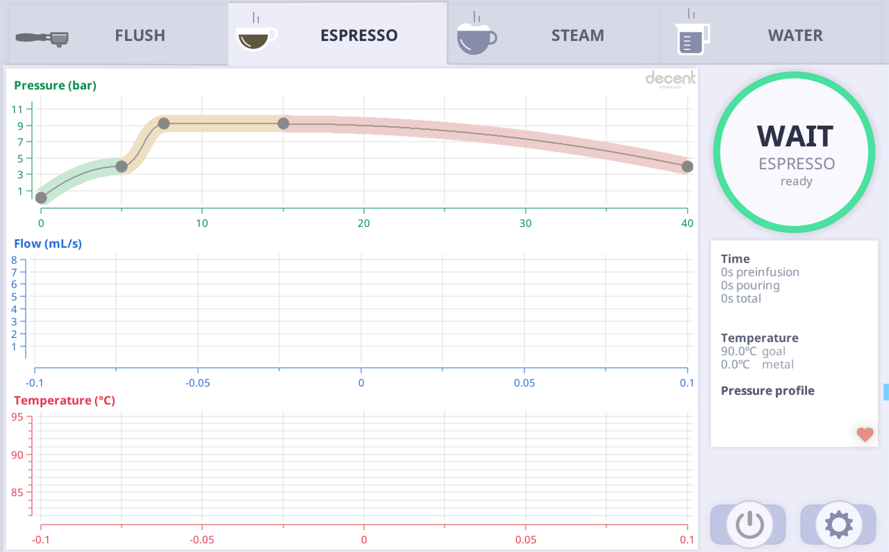
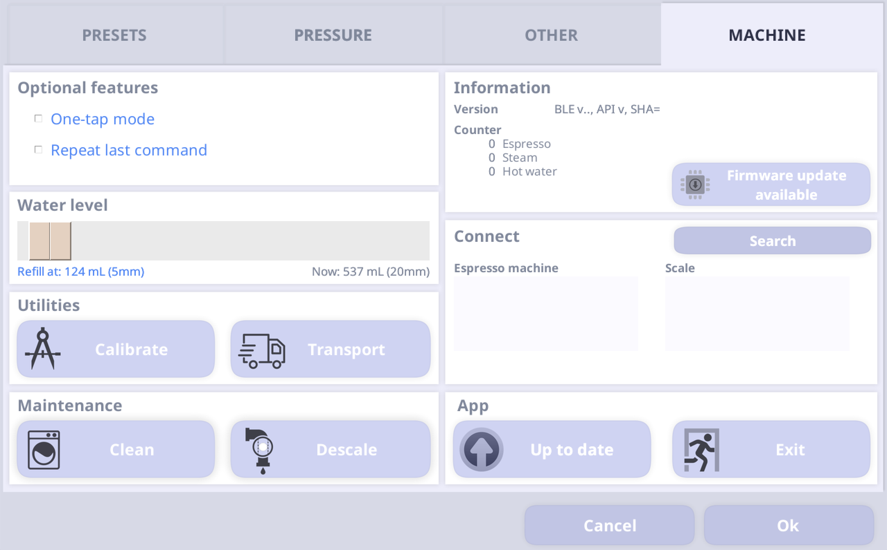

The `de1` npm package lets you completely control the [Decent Espresso](https://decentespresso.com/) Espresso machines via `JavaScript`. It is compatible with all models, including the DE1+, DE1PRO and DE1XL.

## Installation

Install via `npm` or `yarn`

<!--DOCUSAURUS_CODE_TABS-->
<!--npm-->

```bash
❯ npm install de1 --save-exact
```

<!--yarn-->

```bash
❯ yarn add de1 --exact
```

<!--END_DOCUSAURUS_CODE_TABS-->

## Basic Usage

When you import the DE1 library you'll get a `class` with a `static` method to connect to your machine. The return value of this method is a `Promise` that resolves to an instance of the class that is connected to the machine. You can use the methods on this instance to control the machine.

You can find a full description of the API [on the API page](api.md).

```js
import DE1 from "de1";

(async () => {
  const de1 = await DE1.connect();
  await de1.turnOn();
  await de1.startEspresso();
})();
```

This will connect to the machine, turn it on and start and pour an espresso. To be very precise though, your machine needs to be heated up before you can pour an espresso. You can read about it in the next guide on [Turning on and pouring an espresso](turn-on-espresso.md)

## If `DE1.connect()` does not work 😱

Some users will run into the problem that calling this _simply does not work_ (it takes forever and nothing happens):

```js
const de1 = await DE1.connect();
```

The most likely reason for this is simple: Once the machine is connected via Bluetooth to any app it goes _invisible_. This means it cannot be found by any other device or app that is scanning for Bluetooth devices. This also means that your code will never find the machine and keep searching indefinitely. To solve this issue you need to close the app on the tablet and run your script again.

1. On the espresso screen click the cog on the bottom right
1. Switch to the "Machine" tab on the top right
1. Click the "Exit" button on the bottom right
1. The app should close and the machine should go into standby



